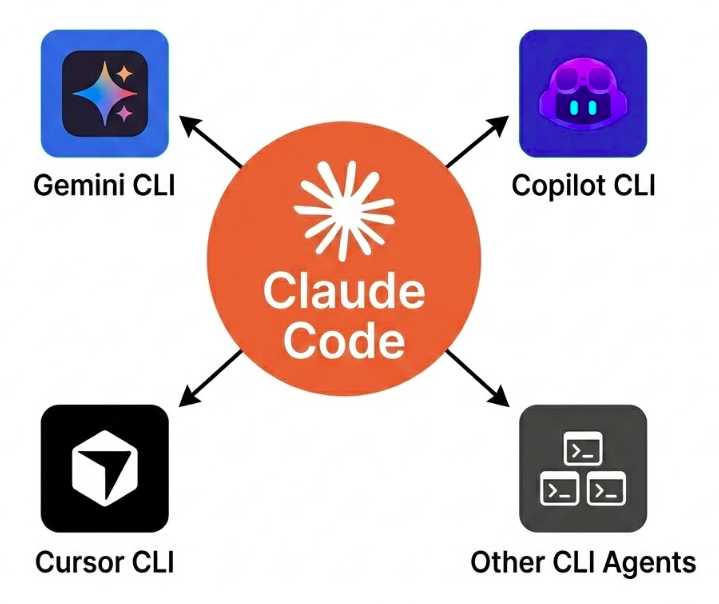

# Subagent CLI Skills

A collection of Skills for cross-agent task delegation. Let Claude Code use Gemini CLI as a subagent to reduce your context usage and costs.

## How It Works

Your primary agent can delegate tasks to other agents that support programmatic usage through the terminal. This offloads context-heavy work, ensuring the main orchestrator stays lean and efficient.

  

By treating CLI tools as specialized subagents, you can bypass context window limitations and significantly reduce token costs. The primary agent remains the high-level decision maker, while the subagents handle the tactical implementation, research, and codebase exploration.

## Installation

1. Identify your agent's skill directory.
2. Copy the desired skill folder from this repository to that directory.
3. Restart your agent or refresh skills.

## Usage

Activate the necessary skills using the `/` command (e.g., `/activate_skill copilot-cli`) supported in many tools. Once activated, simply ask the primary agent to delegate:

> *"Use Gemini CLI to search for the latest documentation of [library] and summarize breaking changes."*

The agent will use the skill to construct a programmatic CLI call, execute the task, and return the summary to the main thread.

## Roadmap & Support

- [x] **Gemini CLI** (Programmatic)
- [x] **Copilot CLI** (Programmatic)
- [x] **Qwen-Code CLI** (Programmatic)
- [x] **Codex CLI** (Programmatic)
- [ ] **Junie CLI**
- [ ] **Kiro CLI**
- [ ] **Cursor CLI**
- [ ] **Antigravity IDE**

## Core Philosophy

The delegation technique and philosophy used in this project are inspired by the principles outlined in **[Don't Build Multi-Agents](https://cognition.ai/blog/dont-build-multi-agents#applying-the-principles)** by Cognition AI.

*   **Context Optimization**: Moves high-volume edits and exploration to an isolated process.
*   **Cost Efficiency**: Reduces the token burden on the main orchestrator.
*   **Specialized Execution**: Leverages tool-specific strengths (e.g., Gemini's Google Search).
