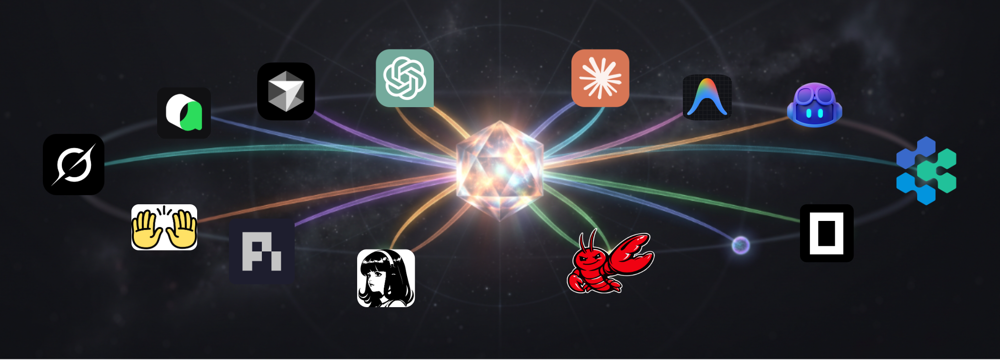

<h3 align="center">Let your Claude Code prompt Codex and Antigravity as Subagent</h3>

<p align="center">
  
</p>

Each folder here is one skill. A skill teaches your main agent to send a task to a different CLI
agent. The other agent does the work in the background. It returns only a summary. Your main agent
keeps a small context and a low cost.

## Usage examples

Name the tool in your request. Your agent then activates the correct skill. You can also type the
slash command yourself. You can name a model for each tool.

**1. Review a feature with two agents and two models**

```
Ask Codex with GPT-Astra and Hermes with GLM-5.3 to review this feature using their subagent cli skills
```

**2. Get the latest documentation**

```
/antigravity-cli Read the latest docs for the Stripe API. List the breaking changes.
```

**3. Build two features at the same time**

```
Build the login form in src/auth/ with Codex. Build the signup form in src/signup/ with OpenCode.
```

**4. Get fresh ideas on a plan from three agents**

```
Ask Pi and Grok and Devin to review the implementation plan to get fresh ideas.
```

## Available skills

19 CLI agents: Antigravity (`agy`), Claude Code, Codex, Copilot, Cursor, Devin, Gemini, Grok,
Hermes, Junie, Kimi Code, Kiro, Mistral Vibe, Oh My Pi, OpenCode, OpenHands, Pi, Qoder, Qwen Code.

Every skill holds two files: `SKILL.md` for the behaviour, and `reference.md` for the flags, models
and authentication.

## Install

```bash
curl -sSL https://raw.githubusercontent.com/amirkiarafiei/subagent-cli-skills/main/install.sh | bash
```

Or ask your agent to do it — see [AGENTIC_INSTALLATION.md](../AGENTIC_INSTALLATION.md).

More detail: [main README](../README.md)
